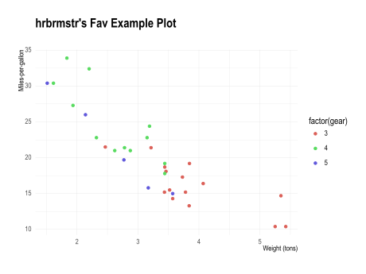

Ref:
<https://dailyfinds.hrbrmstr.dev/p/drop-385-2023-12-08-weekend-project>

Install from git:

``` bash
$ python3 -m pip install git+https://gitlab.com/hrbrmstr/hrbrthemes-p9
```

Install from PyPI:

``` bash
$ python3 -m pip install hrbrthemes
```

``` python
from hrbrthemes import *

from plotnine import *
from plotnine.data import mtcars

(ggplot(mtcars, aes("wt", "mpg", color="factor(gear)")) 
  + geom_point() 
  + labs(title = "hrbrmstr's Fav Example Plot", x = "Weight (tons)", y = "Miles-per-gallon")
  + theme_ipsum())
```


